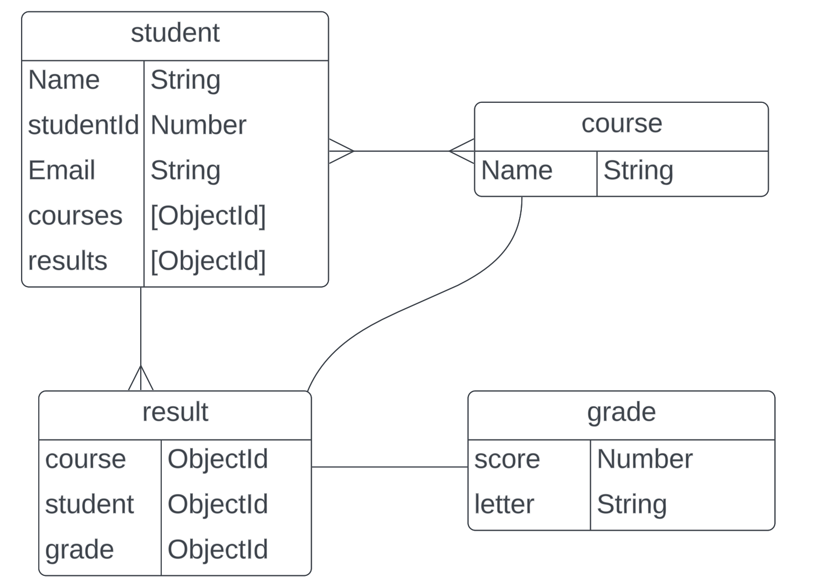

# GA Academy Project

## Meet the GA Academy Team

Our dedicated team members are passionate about creating a vibrant and inclusive space. Get to know the faces behind GA Academy:

- [Salman](https://www.linkedin.com/in/salman-qais-buali/)
- [Nayef](http://www.linkedin.com/in/nayefalzayani)
- [Hamad](https://www.linkedin.com/in/hamad-alfandi-a39aba238/)

## Welcome to GA Academy!

The program will allow the users to create any number of students, and any number of courses, after those have been created, the user will be able to enroll such student to any course and assign them a grade in the process.
Following that when the user goes to the homepage (or when they are redirected when they are done enrolling) they will be able to see the list of students id, name, and their overall GPA, the user can also search for a specific student using the search bar, and finally the user can sort the students by sorting their GPA from the highest to the lowest, when the user clicks on the student, it will show them the list of courses with their respectable grade, and course can be searched too.

## ERD

## Tools

- Vue
- Express JS
- MongoDB
- Mongoose
- Node.JS
- CSS
- JavaScript
- Insomnia
- [Trello](https://trello.com/b/H4OZjR4I/vue-hackathon)
